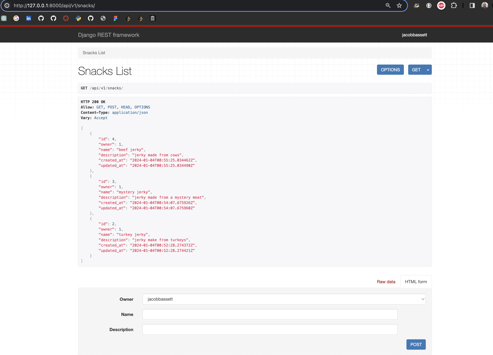
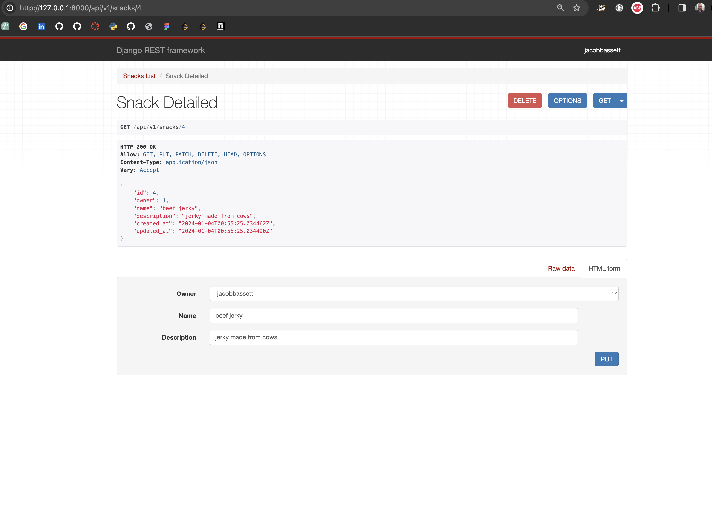

# Django Snacks API

## Author:
Jacob Bassett

## Description:
This is Jacob's first use of the Django REST Framework to build an API. Clients can use this services to read, create, update, and delete snack records.

## Testing:
After downloading and opening a virtual environment, run the following command. Note that some unit tests were inspired by ChatGPT.

```bash
(.venv) ➜  django-snacks-api git:(dev) ✗ python manage.py test
Found 9 test(s).
Creating test database for alias 'default'...
System check identified no issues (0 silenced).
.........
----------------------------------------------------------------------
Ran 9 tests in 1.417s

OK
Destroying test database for alias 'default'...
```

## Usage:

Open application in a docker container.

```bash
(.venv) ➜  django-snacks-api git:(dev) docker compose up
[+] Building 51.4s (12/12) FINISHED                                                                                              docker:desktop-linux
#...
 ✔ Network django-snacks-api_default  Created                                                                                                    0.0s
 ✔ Container django-snacks-api-web-1  Created                                                                                                    0.0s
Attaching to django-snacks-api-web-1
django-snacks-api-web-1  | Watching for file changes with StatReloader
django-snacks-api-web-1  | Performing system checks...
django-snacks-api-web-1  |
django-snacks-api-web-1  |
django-snacks-api-web-1  | System check identified no issues (0 silenced).
django-snacks-api-web-1  | January 04, 2024 - 05:15:45
django-snacks-api-web-1  | Django version 5.0.1, using settings 'project.settings'
django-snacks-api-web-1  | Starting development server at http://0.0.0.0:8000/
django-snacks-api-web-1  | Quit the server with CONTROL-C.
```

Run locally in virtual environment.

```bash
(.venv) ➜  django-snacks-api git:(dev) ✗ python manage.py runserver
Watching for file changes with StatReloader
Performing system checks...

System check identified no issues (0 silenced).
January 04, 2024 - 04:52:41
Django version 5.0.1, using settings 'project.settings'
Starting development server at http://127.0.0.1:8000/
Quit the server with CONTROL-C.
```

This is an example of the get response for all snack records.


This is an example of the get response for an individual snack record.
